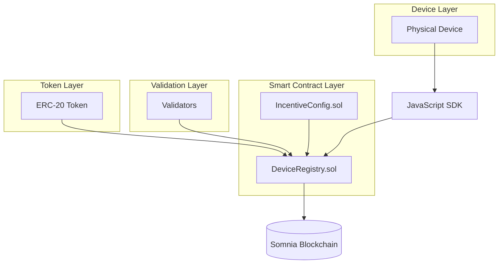

# SomniaPulse DevKit

SomniaPulse is a comprehensive DevKit for building and managing DePIN (Decentralized Physical Infrastructure Networks) on the [Somnia network](https://somnia.network/). It provides tools to register devices, report metrics, verify authenticity, incentivize contributions with a configurable system, and validate network quality.

## 🧩 Features

- Device registration with custom ID
- Generic metric reporting (key-value)
- Cryptographic authentication for devices
- Configurable incentive system based on metrics using any ERC-20 token
- Automatic device verification on first metric report
- Optional staking system with configurable minimums
- External validation and slashing mechanisms
- Modular smart contract architecture
- JavaScript SDK for easy integration
- Network-specific incentive configurations
- Reputation-based incentive bonuses

## 🎯 Use Cases

SomniaPulse can be used in various DePIN scenarios:

### Environmental Monitoring
- **Weather Stations**: Deploy temperature, humidity, and pressure sensors across a region
- **Air Quality Monitoring**: Track pollution levels in cities with incentivized reporting
- **Water Quality Sensors**: Monitor rivers, lakes, and groundwater quality parameters

### IoT Networks
- **Smart Agriculture**: Soil moisture, light, and temperature sensors for precision farming
- **Supply Chain Tracking**: Location and condition monitoring for goods in transit
- **Smart City Infrastructure**: Traffic monitoring, parking sensors, and public utility meters

### Network Infrastructure
- **WiFi Hotspot Networks**: Incentivize uptime and bandwidth contribution
- **Blockchain Node Networks**: Reward nodes for maintaining network health and availability
- **CDN Networks**: Incentivize content caching and delivery performance

### Community Projects
- **Citizen Science Initiatives**: Engage community members with sensor devices for research
- **Local Mesh Networks**: Build decentralized communication networks with community participation
- **Energy Grid Monitoring**: Track renewable energy production and consumption at local level

## 🚀 Opportunities

SomniaPulse creates new opportunities for DePIN development:

### For Developers
- **Rapid Prototyping**: Quickly build and deploy DePIN networks with minimal setup
- **Flexible Incentives**: Customize reward systems for specific network requirements
- **Modular Design**: Extend functionality through contract inheritance and composition

### For Network Operators
- **Quality Assurance**: Validator system ensures data accuracy and network reliability
- **Economic Control**: Configure incentive models to match business objectives
- **Scalable Growth**: Network-specific configurations allow for controlled expansion

### For Device Owners
- **Passive Income**: Earn tokens for maintaining and operating devices
- **Reputation Building**: Gain recognition for consistent, high-quality contributions
- **Flexible Participation**: Choose staking levels based on risk tolerance and investment capacity

### For Validators
- **Network Security**: Earn rewards for maintaining data integrity
- **Governance Participation**: Influence network policies and quality standards
- **Professional Services**: Offer validation services to multiple DePIN networks

## 📁 Project Structure

```
SomniaPulse/
│
├── contracts/              # Solidity contracts
│   ├── DeviceRegistryBase.sol
│   ├── DeviceStaking.sol
│   ├── DeviceMetrics.sol
│   ├── DeviceIncentives.sol
│   ├── DeviceValidation.sol
│   ├── DeviceRegistry.sol
│   └── IncentiveConfig.sol
│
├── sdk/                    # JavaScript SDK
│   ├── index.js
│   ├── pulse_abi.json
│   └── erc20_abi.json
│
├── demo/                   # Example applications
│   ├── demo.js
│   └── validation-demo.js
│
├── package.json
└── README.md
```

## 🏗️ Architecture



## 🚀 Installation

1. Clone the repository:
   ```bash
   git clone https://github.com/Techgethr/somniapulse.git
   cd somniapulse
   ```

2. Install dependencies:
   ```bash
   npm install
   ```

3. Install OpenZeppelin contracts:
   ```bash
   npm install @openzeppelin/contracts
   ```

## 🧱 Deploying Smart Contracts

Before using the SDK, you need to deploy the smart contracts to your desired network:

### 1. Deploy IncentiveConfig Contract
First, deploy the `IncentiveConfig` contract which manages incentive rules for different networks:
```bash
# Deploy IncentiveConfig with supported networks (e.g., ["testnet", "mainnet"])
# This will return the contract address
```

### 2. Configure Incentive Rules
Configure the incentive rules for different metric types:
```javascript
// Example configuration
const incentiveConfig = new ethers.Contract(configAddress, incentiveConfigABI, wallet);

// Configure incentives for different metrics
await incentiveConfig.setMetricConfig("uptime", 100, 100, true, 3600, 100);  // Proportional, hourly limit
await incentiveConfig.setMetricConfig("temperature", 10, 10, false, 600, 50);  // Fixed, 10 min limit
await incentiveConfig.setMetricConfig("default", 5, 5, false, 300, 25);  // Default for other metrics
```

### 3. Deploy DeviceRegistry Contract
Deploy the main `DeviceRegistry` contract with the required parameters:
```bash
# Deploy DeviceRegistry with:
# - Token address (ERC-20 token for incentives)
# - Staking requirement (boolean)
# - Minimum stake amount (if staking required)
# - IncentiveConfig address
# - Network name (must match one configured in IncentiveConfig)
```

### 4. Configure Validators (Optional)
If using the validation system, register validators:
```javascript
// Register validators with minimum staking amounts
await deviceRegistry.registerValidator(validatorAddress, minStakeAmount);
```

You can use the testnet version for the first DePIN created with this DevKit to test the system:

- IncentiveConfig: 0x4dA05ddA2F0586327E956548fd3E88a508ba2168
- DeviceRegistry (network): 0xd0876600e82CCAa4aA0ab0Cd8bEa9c74F5b46De3

_These addresses are from the Somnia testnet_


## 🧱 Compiling Contracts

```bash
solcjs --abi --bin contracts/DeviceRegistry.sol -o contracts/
```

## ▶️ Running the Demos

### Basic Demo
1. Deploy the contracts to a testnet.
2. Update `demo/demo.js` with contract addresses and private keys.
3. Run the demo:
   ```bash
   npm run demo
   ```

### Validation Demo
1. Deploy the contracts to a testnet.
2. Update `demo/validation-demo.js` with contract addresses and private keys.
3. Run the validation demo:
   ```bash
   node demo/validation-demo.js
   ```

## 🛠️ SDK Usage

### Initialization
```javascript
const SomniaPulseSDK = require("./sdk/index.js");

const sdk = new SomniaPulseSDK(network, contractAddress);
await sdk.initializeWallet(privateKey);
```

Where:
- `network` is either `"testnet"` or `"mainnet"`
- `contractAddress` is the address of the deployed DeviceRegistry contract

The SDK automatically retrieves the ERC-20 token address from the DeviceRegistry contract, so there's no need to provide it as a parameter. It also includes both the DeviceRegistry ABI and the ERC20 ABI internally.

### Device Management
```javascript
// Register device
await sdk.registerDevice("sensor-001", ownerAddress, stakeAmount);

// Stake tokens for device
await sdk.stakeTokens("sensor-001", amount);

// Unstake tokens from device
await sdk.unstakeTokens("sensor-001");

// Report metric with cryptographic authentication
// Device is automatically verified when first metric is reported
await sdk.reportMetric("sensor-001", "temperature", 25);
```

### Query Functions
```javascript
// Check if device is verified
await sdk.isVerified("sensor-001");

// Get specific metric value
await sdk.getMetric("sensor-001", "temperature");

// Get device incentives
await sdk.getIncentives("sensor-001");

// Get staked amount for device
await sdk.getStakedAmount("sensor-001");

// Get list of all registered devices
await sdk.getDeviceList();

// Get device by index
await sdk.getDeviceAtIndex(0);

// Get token balance
await sdk.getTokenBalance();
```

### Validator Functions
```javascript
// Register validator (owner only)
await sdk.registerValidator(validatorAddress, minStakeAmount);

// Validator stakes tokens
await sdk.stakeValidatorTokens(amount);

// Validator unstakes tokens
await sdk.unstakeValidatorTokens();

// Validator reports malbehavior
await sdk.reportMalBehavior("sensor-001", "Invalid temperature", proof);

// Get validator info
await sdk.getValidatorInfo(validatorAddress);
```

### Owner Functions
```javascript
// Verify malbehavior report (owner only)
await sdk.verifyReport(reportId, true);

// Set slashing percentage (owner only)
await sdk.setSlashingPercentage(10); // 10%
```

## 📜 Smart Contract Methods

### DeviceRegistry.sol (Main Contract)

#### Constructor
- `DeviceRegistry(address _tokenAddress, bool _stakingRequired, uint256 _minStakeAmount, address _incentiveConfigAddress, string memory _network)` - Initialize the contract with token, staking configuration, incentive configuration, and network

#### Device Management
- `registerDevice(string memory _deviceId, address _owner, uint256 _stakeAmount)` - Register a new device
- `stakeTokens(string memory _deviceId, uint256 _amount)` - Stake tokens for a device
- `unstakeTokens(string memory _deviceId)` - Unstake tokens from a device
- `getDeviceList() returns (string[] memory)` - Get list of all registered devices
- `getDeviceAtIndex(uint256 index) returns (string memory)` - Get device by index

#### Metric Reporting
- `reportMetric(string memory _deviceId, string memory _metricName, uint256 _value, bytes memory signature)` - Report a metric with cryptographic authentication
- `getMetric(string memory _deviceId, string memory _metricName) returns (uint256)` - Get a specific metric value
- `isVerified(string memory _deviceId) returns (bool)` - Check if device is verified

#### Staking Configuration
- `stakingRequired() returns (bool)` - Check if staking is required
- `minStakeAmount() returns (uint256)` - Get minimum staking amount
- `getStakedAmount(string memory _deviceId) returns (uint256)` - Get staked amount for device

### DeviceStaking.sol (Staking Contract)

#### Constructor
- `DeviceStaking(address _tokenAddress, bool _stakingRequired, uint256 _minStakeAmount, address _incentiveConfigAddress)` - Initialize the contract with token, staking configuration, and incentive configuration

#### Staking Functions
- `stakeTokens(string memory _deviceId, uint256 _amount)` - Stake tokens for a device
- `unstakeTokens(string memory _deviceId)` - Unstake tokens from a device
- `checkStakingRequirement(string memory _deviceId) returns (bool)` - Check if staking requirements are met

#### Incentives
- `getIncentives(string memory _deviceId) returns (uint256)` - Get incentives for device
- `distributeIncentives(string memory _deviceId, string memory _metricName, uint256 _value)` - Internal function to distribute incentives

### DeviceIncentives.sol (Incentive Contract)

#### Constructor
- `DeviceIncentives(address _tokenAddress, bool _stakingRequired, uint256 _minStakeAmount, address _incentiveConfigAddress, string memory _network)` - Initialize the contract with token, staking configuration, incentive configuration, and network

#### Incentive Functions
- `calculateWeightedIncentive(string memory _metricName, uint256 _value) returns (uint256)` - Calculate weighted incentive based on metric configuration
- `calculateReputationBonus(string memory _deviceId) returns (uint256)` - Calculate reputation bonus based on device's validation history
- `calculateConsistencyBonus(string memory _deviceId, string memory _metricName) returns (uint256)` - Calculate consistency bonus based on reporting frequency

#### Validation (Owner Functions)
- `registerValidator(address _validator, uint256 _minStakeAmount)` - Register a new validator
- `verifyReport(uint256 _reportId, bool _isValid)` - Verify a malbehavior report
- `setSlashingPercentage(uint256 _percentage)` - Set slashing percentage (0-100%)
- `getValidatorInfo(address _validator) returns (Validator memory)` - Get validator information

#### Validator Functions
- `stakeValidatorTokens(uint256 _amount)` - Validator stakes tokens
- `unstakeValidatorTokens()` - Validator unstakes tokens
- `reportMalBehavior(string memory _deviceId, string memory _reason, bytes memory _proof)` - Report device malbehavior

#### Internal Functions
- `recoverSigner(bytes32 ethSignedMessageHash, bytes memory signature) returns (address)` - Recover signer from signature
- `splitSignature(bytes memory sig) returns (bytes32 r, bytes32 s, uint8 v)` - Split signature into components

### IncentiveConfig.sol (Configuration Contract)

#### Constructor
- `IncentiveConfig(string[] memory supportedNetworks)` - Initialize the contract with a list of supported networks

#### Configuration Management
- `setMetricConfig(string memory _metricName, uint256 _baseReward, uint256 _maxReward, bool _proportional, uint256 _frequencyLimit, uint256 _weight)` - Configure incentive rules for a metric type
- `getMetricConfig(string memory _metricName) returns (MetricConfig memory)` - Get configuration for a metric type
- `isNetworkSupported(string memory _network) returns (bool)` - Check if a network is supported

## 🧮 Staking and Validation System

### Staking Options
- **Optional Staking**: Networks can choose whether staking is required
- **Configurable Minimums**: Set minimum staking amounts
- **Staking Bonuses**: Devices with higher stakes receive bonus incentives

### Validation Process
1. Owner registers validators with custom minimum staking amounts
2. Validators stake tokens to participate in validation
3. Validators report malbehavior with cryptographic proof
4. Owner verifies reports and executes slashing if valid
5. Valid validators receive rewards from slashed amounts

### Device Verification
Devices are automatically verified when they report their first metric, eliminating the need for a separate verification step.

### Slashing Mechanism
- **Staking-Based Slashing**: If device has staked tokens, slash from staking balance
- **Incentive-Based Slashing**: If no staking, slash from accumulated incentives
- **Configurable Percentage**: Owner sets slashing percentage (0-100%)
- **Validator Rewards**: Valid validators receive slashed amounts as rewards

## 💰 Incentive System

The improved incentive system is now more flexible and adaptable to different networks:

### IncentiveConfig.sol
A new contract that allows network-specific configuration of incentives:
- **Metric-specific rewards**: Different rewards for different metric types
- **Proportional vs Fixed rewards**: Choose between proportional rewards (based on value) or fixed rewards
- **Frequency limits**: Prevent abuse by limiting how often metrics can be reported
- **Weighting system**: Assign different weights to different metrics
- **Network-specific configurations**: Each network can have its own incentive rules

### Incentive Calculation
The new system calculates incentives using multiple factors:
1. **Base Incentive**: Configured reward for each metric type
2. **Reputation Bonus**: Based on the device's validation history
3. **Consistency Bonus**: Rewards for consistent reporting
4. **Staking Bonus**: Additional rewards for staked devices

### Network Adaptability
Each network (testnet, mainnet) can have its own incentive configuration, making the system adaptable to different use cases and economic models.

## 🏗️ Modular Architecture

The smart contracts are organized in a modular inheritance structure:

```
DeviceRegistryBase.sol
    ↓
DeviceStaking.sol
    ↓
DeviceMetrics.sol
    ↓
DeviceIncentives.sol
    ↓
DeviceValidation.sol
    ↓
DeviceRegistry.sol
```

Each contract handles specific functionality:
- **DeviceRegistryBase**: Core structures and common functions
- **DeviceStaking**: Staking mechanisms for devices
- **DeviceMetrics**: Metric reporting and verification
- **DeviceIncentives**: Incentive distribution system
- **DeviceValidation**: External validation and slashing
- **DeviceRegistry**: Main contract that inherits all functionality
- **IncentiveConfig**: Configuration contract for network-specific incentive rules

## 📜 License

MIT