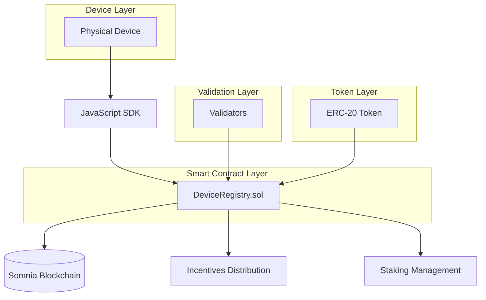

# SomniaPulse DevKit

SomniaPulse is a DevKit for building and managing DePIN (Decentralized Physical Infrastructure Networks) on the Somnia network. It provides tools to register devices, report metrics, verify authenticity, and incentivize contributions.

## 🧩 Features

- Device registration with custom ID
- Generic metric reporting (key-value)
- Cryptographic authentication for devices
- Incentive system based on metrics using any ERC-20 token
- Device listing and verification
- Staking and external validation mechanisms
- JavaScript SDK for easy integration

## 📁 Project Structure

```
SomniaPulse/
│
├── contracts/              # Solidity contracts
│   └── DeviceRegistry.sol
│
├── sdk/                    # JavaScript SDK
│   └── index.js
│
├── demo/                   # Example application
│   └── demo.js
│
├── package.json
└── README.md
```

## 🏗️ Architecture



## 🚀 Installation

1. Clone the repository:
   ```bash
   git clone <repo-url>
   cd SomniaPulse
   ```

2. Install dependencies:
   ```bash
   npm install
   ```

3. Install OpenZeppelin contracts:
   ```bash
   npm install @openzeppelin/contracts
   ```

## 🧱 Compiling Contracts

```bash
solcjs --abi --bin contracts/DeviceRegistry.sol -o contracts/
```

## ▶️ Running the Demo

1. Deploy the contracts to a testnet.
2. Update `demo/demo.js` with contract addresses and private key.
3. Run the demo:
   ```bash
   npm run demo
   ```

## 🛠️ SDK Usage

```javascript
const SomniaPulseSDK = require("./sdk/index.js");

const sdk = new SomniaPulseSDK(providerUrl, contractAddress, abiPath, tokenAddress, tokenAbiPath);
await sdk.initializeWallet(privateKey);

// Register device
await sdk.registerDevice("sensor-001", ownerAddress);

// Report metric
await sdk.reportMetric("sensor-001", "temperature", 25);

// Verify device
await sdk.verifyDevice("sensor-001");
```

## 📜 License

MIT