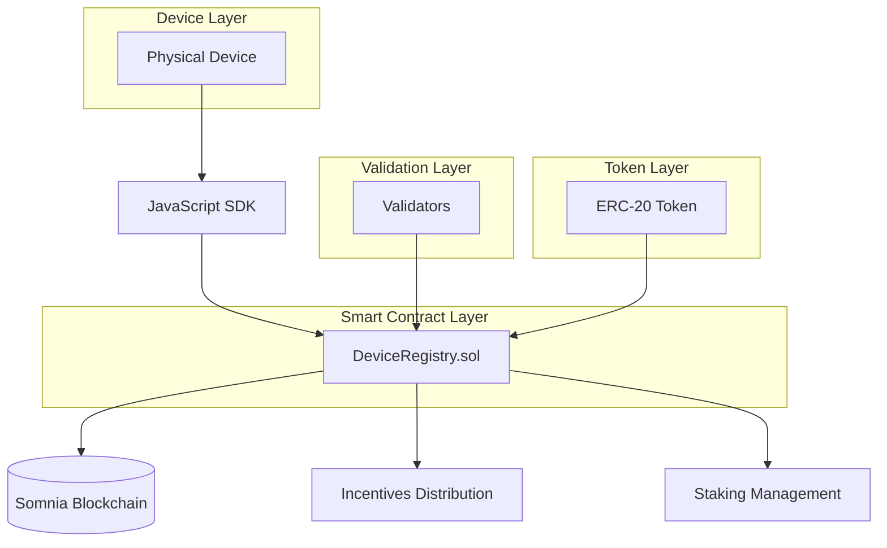

# SomniaPulse DevKit

SomniaPulse is a comprehensive DevKit for building and managing DePIN (Decentralized Physical Infrastructure Networks) on the Somnia network. It provides tools to register devices, report metrics, verify authenticity, incentivize contributions, and validate network quality.

## 🧩 Features

- Device registration with custom ID
- Generic metric reporting (key-value)
- Cryptographic authentication for devices
- Incentive system based on metrics using any ERC-20 token
- Optional staking system with configurable minimums
- External validation and slashing mechanisms
- Modular smart contract architecture
- JavaScript SDK for easy integration

## 📁 Project Structure

```
SomniaPulse/
│
├── contracts/              # Solidity contracts
│   ├── DeviceRegistryBase.sol
│   ├── DeviceStaking.sol
│   ├── DeviceMetrics.sol
│   ├── DeviceIncentives.sol
│   ├── DeviceValidation.sol
│   └── DeviceRegistry.sol
│
├── sdk/                    # JavaScript SDK
│   └── index.js
│
├── demo/                   # Example applications
│   ├── demo.js
│   └── validation-demo.js
│
├── package.json
└── README.md
```

## 🏗️ Architecture



## 🚀 Installation

1. Clone the repository:
   ```bash
   git clone <repo-url>
   cd SomniaPulse
   ```

2. Install dependencies:
   ```bash
   npm install
   ```

3. Install OpenZeppelin contracts:
   ```bash
   npm install @openzeppelin/contracts
   ```

## 🧱 Compiling Contracts

```bash
solcjs --abi --bin contracts/DeviceRegistry.sol -o contracts/
```

## ▶️ Running the Demos

### Basic Demo
1. Deploy the contracts to a testnet.
2. Update `demo/demo.js` with contract addresses and private keys.
3. Run the demo:
   ```bash
   npm run demo
   ```

### Validation Demo
1. Deploy the contracts to a testnet.
2. Update `demo/validation-demo.js` with contract addresses and private keys.
3. Run the validation demo:
   ```bash
   node demo/validation-demo.js
   ```

## 🛠️ SDK Usage

### Initialization
```javascript
const SomniaPulseSDK = require("./sdk/index.js");

const sdk = new SomniaPulseSDK(network, contractAddress, abiPath, tokenAddress, tokenAbiPath);
await sdk.initializeWallet(privateKey);
```

Where `network` is either `"testnet"` or `"mainnet"`, with predefined RPC endpoints:
- Testnet: `https://dream-rpc.somnia.network/`
- Mainnet: `https://api.infra.mainnet.somnia.network/`

### Device Management
```javascript
// Register device
await sdk.registerDevice("sensor-001", ownerAddress, stakeAmount);

// Stake tokens for device
await sdk.stakeTokens("sensor-001", amount);

// Unstake tokens from device
await sdk.unstakeTokens("sensor-001");

// Report metric with cryptographic authentication
await sdk.reportMetric("sensor-001", "temperature", 25);

// Verify device
await sdk.verifyDevice("sensor-001");
```

### Query Functions
```javascript
// Check if device is verified
await sdk.isVerified("sensor-001");

// Get specific metric value
await sdk.getMetric("sensor-001", "temperature");

// Get device incentives
await sdk.getIncentives("sensor-001");

// Get staked amount for device
await sdk.getStakedAmount("sensor-001");

// Get list of all registered devices
await sdk.getDeviceList();

// Get device by index
await sdk.getDeviceAtIndex(0);

// Get token balance
await sdk.getTokenBalance();
```

### Validator Functions
```javascript
// Register validator (owner only)
await sdk.registerValidator(validatorAddress, minStakeAmount);

// Validator stakes tokens
await sdk.stakeValidatorTokens(amount);

// Validator unstakes tokens
await sdk.unstakeValidatorTokens();

// Validator reports malbehavior
await sdk.reportMalBehavior("sensor-001", "Invalid temperature", proof);

// Get validator info
await sdk.getValidatorInfo(validatorAddress);
```

### Owner Functions
```javascript
// Verify malbehavior report (owner only)
await sdk.verifyReport(reportId, true);

// Set slashing percentage (owner only)
await sdk.setSlashingPercentage(10); // 10%
```

## 📜 Smart Contract Methods

### DeviceRegistry.sol (Main Contract)

#### Device Management
- `registerDevice(string memory _deviceId, address _owner, uint256 _stakeAmount)` - Register a new device
- `stakeTokens(string memory _deviceId, uint256 _amount)` - Stake tokens for a device
- `unstakeTokens(string memory _deviceId)` - Unstake tokens from a device
- `verifyDevice(string memory _deviceId)` - Verify a device
- `getDeviceList() returns (string[] memory)` - Get list of all registered devices
- `getDeviceAtIndex(uint256 index) returns (string memory)` - Get device by index

#### Metric Reporting
- `reportMetric(string memory _deviceId, string memory _metricName, uint256 _value, bytes memory signature)` - Report a metric with cryptographic authentication
- `getMetric(string memory _deviceId, string memory _metricName) returns (uint256)` - Get a specific metric value
- `isVerified(string memory _deviceId) returns (bool)` - Check if device is verified

#### Staking Configuration
- `stakingRequired() returns (bool)` - Check if staking is required
- `minStakeAmount() returns (uint256)` - Get minimum staking amount
- `getStakedAmount(string memory _deviceId) returns (uint256)` - Get staked amount for device

#### Incentives
- `getIncentives(string memory _deviceId) returns (uint256)` - Get incentives for device
- `distributeIncentives(string memory _deviceId, string memory _metricName, uint256 _value)` - Internal function to distribute incentives

#### Validation (Owner Functions)
- `registerValidator(address _validator, uint256 _minStakeAmount)` - Register a new validator
- `verifyReport(uint256 _reportId, bool _isValid)` - Verify a malbehavior report
- `setSlashingPercentage(uint256 _percentage)` - Set slashing percentage (0-100)
- `getValidatorInfo(address _validator) returns (Validator memory)` - Get validator information

#### Validator Functions
- `stakeValidatorTokens(uint256 _amount)` - Validator stakes tokens
- `unstakeValidatorTokens()` - Validator unstakes tokens
- `reportMalBehavior(string memory _deviceId, string memory _reason, bytes memory _proof)` - Report device malbehavior

#### Internal Functions
- `recoverSigner(bytes32 ethSignedMessageHash, bytes memory signature) returns (address)` - Recover signer from signature
- `splitSignature(bytes memory sig) returns (bytes32 r, bytes32 s, uint8 v)` - Split signature into components
- `calculateBaseIncentive(string memory _metricName, uint256 _value) returns (uint256)` - Calculate base incentive

## 🧮 Staking and Validation System

### Staking Options
- **Optional Staking**: Networks can choose whether staking is required
- **Configurable Minimums**: Set minimum staking amounts
- **Staking Bonuses**: Devices with higher stakes receive bonus incentives

### Validation Process
1. Owner registers validators with custom minimum staking amounts
2. Validators stake tokens to participate in validation
3. Validators report malbehavior with cryptographic proof
4. Owner verifies reports and executes slashing if valid
5. Valid validators receive rewards from slashed amounts

### Slashing Mechanism
- **Staking-Based Slashing**: If device has staked tokens, slash from staking balance
- **Incentive-Based Slashing**: If no staking, slash from accumulated incentives
- **Configurable Percentage**: Owner sets slashing percentage (0-100%)
- **Validator Rewards**: Valid validators receive slashed amounts as rewards

## 🏗️ Modular Architecture

The smart contracts are organized in a modular inheritance structure:

```
DeviceRegistryBase.sol
    ↓
DeviceStaking.sol
    ↓
DeviceMetrics.sol
    ↓
DeviceIncentives.sol
    ↓
DeviceValidation.sol
    ↓
DeviceRegistry.sol
```

Each contract handles specific functionality:
- **DeviceRegistryBase**: Core structures and common functions
- **DeviceStaking**: Staking mechanisms for devices
- **DeviceMetrics**: Metric reporting and verification
- **DeviceIncentives**: Incentive distribution system
- **DeviceValidation**: External validation and slashing
- **DeviceRegistry**: Main contract that inherits all functionality

## 📜 License

MIT